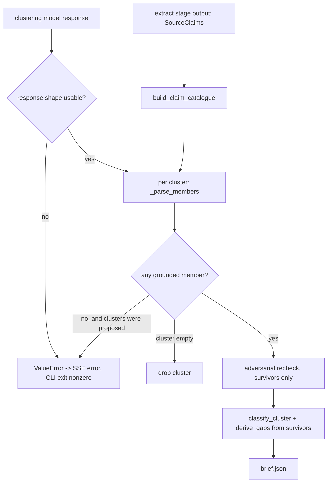

# Handoff — how to change this safely

Written for the next engineer, who has not met me.

## What changed, in one paragraph

The reasoning stage used to trust the clustering model's output. It now accepts a cluster member only when the triple `(source_id, claim_text, supporting_quote)` matches something the extraction stage actually produced. Everything else about the stage is unchanged: same prompts, same model protocol, same `Brief` contract, same API.

## Where the knobs are

| Thing | Where |
|---|---|
| The association catalogue | `build_claim_catalogue` in `src/research_agent/reason.py` |
| The accept/reject rule, one reason code per rejection | `_validate_member`, same file |
| The comparison's strictness | `_norm`, which is `_norm_ws` from `extract.py` plus lowercase. Change this and you change what counts as grounded. |
| Where filtering happens in the stage order | `_parse_members` is called inside `_finalize`, before the adversarial call, classification and gap derivation |
| When a stance revision may apply | `_adversarial_recheck`: one surviving member for that source, and agreeing revisions |
| What makes the stage fail loudly | the `ValueError` raises at the top of `build_claim_graph` and the all-rejected check after `gather` |

## The flow

## Review checklist for a change in this area

1. Does `make check` pass, and does the before/after table still show 4 invalid members retained at the baseline and 0 now?
2. Does the all-valid golden fixture still produce byte-identical output?
3. If you loosened `_norm`, what previously rejected input is now accepted, and is that intended?
4. Does filtering still happen before the adversarial call? Check that a rejected source id never appears in a recheck prompt.
5. Can a malformed response still reach `brief.json`? It must raise instead.
6. Is an explicitly empty `clusters` list still a legitimate success?
7. Do the logs still carry only counts and reason codes, with no claim, quote or source text?
8. Did you add a reason code without a test that names it?
9. Are duplicate valid members still kept, and still unable to create consensus?
10. Are new numbers in any document labelled measured, fixture-only proxy, or unavailable?

## The handoff exercise, done on a disposable branch

To show this is executable by someone else, I performed the smallest adjacent task myself and kept it **out** of the submitted P2 diff: branch `quest/p4-api-url-validation`, commit `a5b45a9`.

It rejects unsafe URLs at `POST /api/research` by reusing the existing fetch-time `is_safe_url` guard, so a bad URL is a 422 at the door rather than a failure mid-run. Its patch and its test output are in `quest/p4-handoff/` in this branch, and the same commit sits on branch `quest/p4-api-url-validation`; 66 tests pass there.

Two honest notes about it. First, it is **input validation, not complete SSRF protection**: `is_safe_url` does not resolve DNS and does not re-check redirects, which `fetch.py` already says. A hostname that resolves to a private address still passes. Second, adding it **broke four pre-existing API tests** that posted placeholder URLs such as `u1`, and those tests had to be updated. That is exactly the kind of cost a handoff note should warn about rather than hide.

This exercise was self-performed and is labelled as such. It is not evidence that an unrelated engineer completed it.
